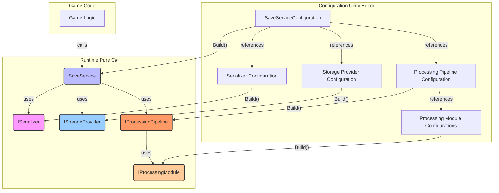
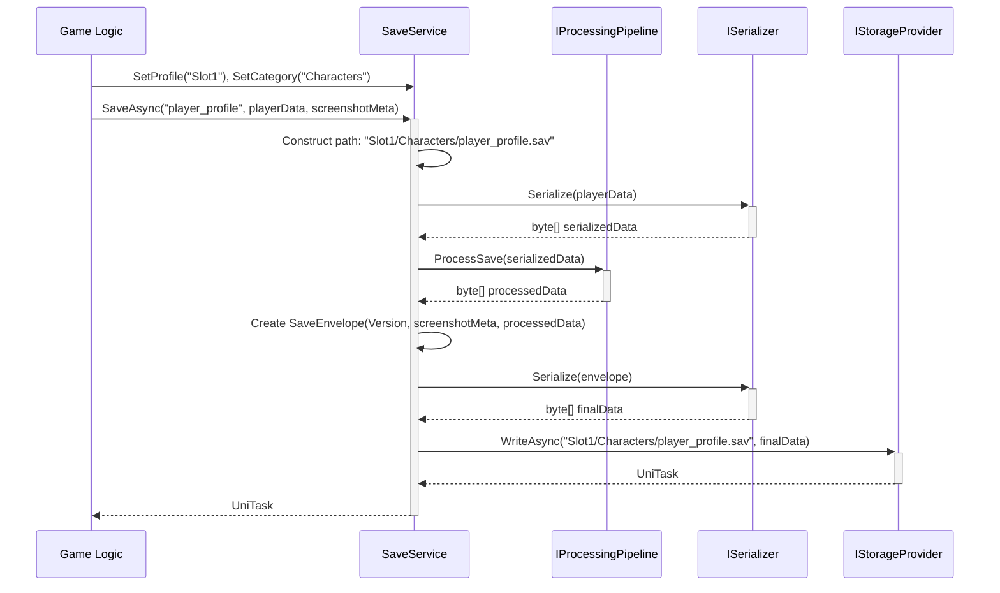
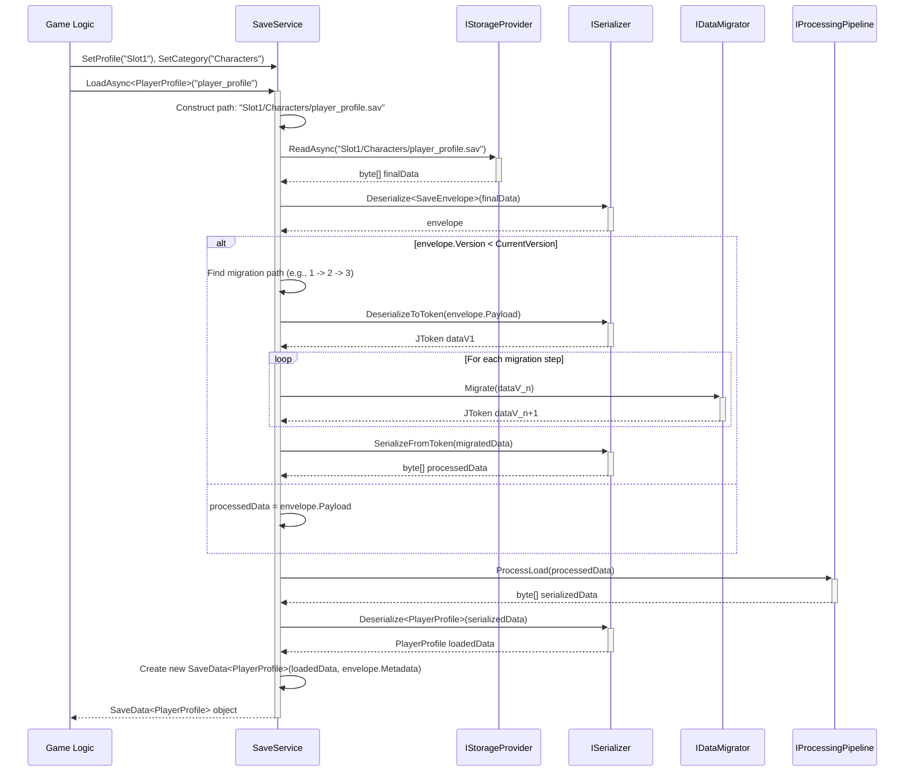

# Project Overview

This document outlines the architectural design for a professional, modular, and extensible save system for the Unity game engine. The system is designed from the ground up to be robust, performant, and highly configurable to meet the demands of modern game development.

As a C#-first framework, it prioritizes clean code, separation of concerns, and developer experience. The core `SaveService` is a pure C# object, ensuring it is lightweight and easily testable outside of Unity's runtime. Configuration is handled elegantly through a series of `ScriptableObject` assets, allowing designers and developers to visually construct and tweak the entire save/load pipeline without writing code.

Based on the initial requirements and clarifying questions, the system will adhere to the following key principles:

- **Modular & Extensible:** Core functionalities like serialization, storage, and data processing are abstracted behind interfaces, allowing developers to implement and plug in their own custom solutions.
- **Configurable Pipeline:** A processing pipeline allows for modular steps like compression and encryption to be easily added, removed, and reordered.
- **Dual-Mode Operations:** The system provides both synchronous and asynchronous (`UniTask`-based) methods for all save and load operations, giving developers full control over performance trade-offs.
- **Robust Error Handling:** All errors are surfaced as thrown exceptions, providing clear, immediate feedback and allowing the calling code to implement its own handling strategy.
- **Automated Data Migration:** A built-in versioning and migration system allows developers to define logic for upgrading save data from older versions, ensuring long-term support for game updates.
- **Atomic Saves:** To prevent data corruption, the system uses a primary/backup file rotation strategy, ensuring that a valid save file is almost always available, even if the application crashes mid-write.
- **Centralized Configuration:** A single "master" `ScriptableObject` serves as the entry point for configuring the entire `SaveService`, referencing all other dependencies like serializers and processing modules.
- **Polished Developer Experience:** All configuration assets will feature highly polished custom inspectors built with UI Toolkit, including features like reorderable lists, visual feedback, and in-editor debugging tools.
- **Profiles & Categories:** The system supports save slots (profiles) and data categories, allowing for organized and separated save files (e.g., `Slot1/World/`, `Slot1/Settings/`).
- **Flexible Metadata:** A mechanism to optionally attach, save, and load arbitrary metadata (e.g., save time, screenshots) to each save entry, without burdening the developer with unnecessary data.

# High-Level Architecture

The system is composed of a lightweight runtime layer (pure C# objects) and a Unity-based configuration layer (`ScriptableObject` assets). The configuration layer is responsible for building the runtime layer.



# Components and Modules

## 1. Core Interfaces

These define the contracts for all runtime components.

```csharp
// A marker interface for any kind of metadata.
public interface IMetadata { }

// Example basic metadata
public class StandardMetadata : IMetadata
{
    public DateTime SaveTime { get; set; }
    public string GameVersion { get; set; }
}

// Example metadata including a screenshot
public class ScreenshotMetadata : StandardMetadata
{
    // PNG-encoded bytes of a screenshot
    public byte[] ScreenshotData { get; set; }
}

// A wrapper for loaded data, combining the deserialized object and its metadata.
public class SaveData<T>
{
    public T Data { get; }
    public IMetadata Metadata { get; }

    public SaveData(T data, IMetadata metadata)
    {
        Data = data;
        Metadata = metadata;
    }
}

// A wrapper for the entire save file, including version, metadata, and the main data payload.
// This is the object that is ultimately serialized to a byte array.
public class SaveEnvelope
{
    public int Version;    
    public IMetadata Metadata;
    public byte[] Payload; // The actual game data, serialized separately.
}

// Interface for data migration logic.
public interface IDataMigrator
{
    int FromVersion { get; }
    int ToVersion { get; }
    // Using Newtonsoft.Json.Linq.JToken for flexible, schema-agnostic migration.
    JToken Migrate(JToken sourceData);
}

// The main service interface.
public interface ISaveService
{
    /// <summary>
    /// Sets the active profile (save slot). All subsequent operations will use this profile.
    /// </summary>
    /// <param name="profileName">The name of the profile (e.g., "Slot1").</param>
    void SetProfile(string profileName);

    /// <summary>
    /// Sets the active category. All subsequent operations will use this category within the active profile.
    /// </summary>
    /// <param name="categoryName">The name of the category (e.g., "WorldState").</param>
    void SetCategory(string categoryName);

    // Synchronous Operations
    void Save<T>(string key, T data, IMetadata metadata = null);
    SaveData<T> Load<T>(string key);

    // Asynchronous Operations with UniTask
    UniTask SaveAsync<T>(string key, T data, IMetadata metadata = null);
    UniTask<SaveData<T>> LoadAsync<T>(string key);
}

public interface ISerializer
{
    byte[] Serialize(object data);
    T Deserialize<T>(byte[] data);
    // For migration purposes
    JToken DeserializeToToken(byte[] data);
    byte[] SerializeFromToken(JToken token);
}

public interface IStorageProvider
{
    // Synchronous Operations
    void Write(string key, byte[] data);
    byte[] Read(string key);
    bool Exists(string key);

    // Asynchronous Operations with UniTask
    UniTask WriteAsync(string key, byte[] data);
    UniTask<byte[]> ReadAsync(string key);
    UniTask<bool> ExistsAsync(string key);
}

public interface IProcessingModule
{
    byte[] Process(byte[] input);
    byte[] Reverse(byte[] input);
}

public interface IProcessingPipeline
{
    List<IProcessingModule> AllModules { get; }
    byte[] ProcessSave(byte[] data);
    byte[] ProcessLoad(byte[] data);
    List<IProcessingModule> GetProcessingChain();
}
```

## 2. ScriptableObject Configurations

Each interface has a corresponding `ScriptableObject` configuration base class.

```csharp
public abstract class SerializerConfiguration : ScriptableObject
{
    public abstract ISerializer Build();
}

public abstract class StorageProviderConfiguration : ScriptableObject
{
    public abstract IStorageProvider Build();
}

public abstract class ProcessingModuleConfiguration : ScriptableObject
{
    public abstract IProcessingModule Build();
}

public abstract class ProcessingPipelineConfiguration : ScriptableObject
{
    public abstract IProcessingPipeline Build();
}

public abstract class DataMigratorConfiguration : ScriptableObject
{
    public abstract IDataMigrator Build();
}

// The master configuration that assembles the service.
[CreateAssetMenu(fileName = "SaveServiceConfiguration", menuName = "FLFloppa/Save System/Save Service Configuration")]
public class SaveServiceConfiguration : ScriptableObject
{
    [Tooltip("The current version of the save data structure.")]
    public int CurrentVersion = 1;

    [Header("Core Components")]
    public SerializerConfiguration Serializer;
    public StorageProviderConfiguration StorageProvider;
    public ProcessingPipelineConfiguration ProcessingPipeline;

    [Header("Data Migration")]
    [Tooltip("A list of all migrators. They will be chained automatically.")]
    public List<DataMigratorConfiguration> Migrators;

    public ISaveService Build()
    {
        var migratorMap = Migrators.Select(m => m.Build()).ToDictionary(m => m.FromVersion);
        return new SaveService(
            CurrentVersion,
            Serializer.Build(),
            StorageProvider.Build(),
            ProcessingPipeline.Build(),
            migratorMap
        );
    }
}
```

## 3. Default Implementations

-   **`SaveService`**: Implements `ISaveService`. Orchestrates the entire save/load flow, including version checks, migration, processing, serialization, and storage.
-   **`UnityJsonSerializer`**: Uses `JsonUtility`. Fast but limited (no dictionaries, etc.). Will be configured to ignore missing fields where possible.
-   **`NewtonsoftJsonSerializer`**: Uses `Newtonsoft.Json`. More powerful and flexible. This will be the recommended default for its robust handling of different data structures and attributes for backward compatibility (`JsonProperty`, `DefaultValueHandling`).
-   **`IniSerializer`**: A custom serializer for INI file formats, suitable for simple key-value configuration data.
-   **`FileSystemStorageProvider`**: Implements the primary/backup (`.sav`/`.bak`) rotation strategy for atomic writes. It will write to the backup, verify, delete the primary, and rename the backup.
-   **`AllProcessingPipeline`**: A simple pipeline that executes all provided modules in order for saving, and in reverse order for loading.
-   **`GZipCompressionProcessingModule`**: Compresses and decompresses data using `GZipStream`.
-   **`AESEncryptionProcessingModule`**: Encrypts and decrypts data using AES. The `ScriptableObject` configuration will have a field for the password/key.

# Data Models and Schemas

## `Result<T>` Object (Removed)

As per the user's choice, the system will use exceptions for error handling, making a `Result<T>` object unnecessary.

## `SaveEnvelope`


To handle versioning and metadata, all saved data will be wrapped in an envelope object before serialization. Using a non-generic `SaveEnvelope` and serializing the main data to a `byte[]` payload first allows the system to handle metadata and versioning at a higher level, before needing to know the specific type of the main data.


```csharp

// The object that actually gets serialized to the storage provider.

public class SaveEnvelope

{

    public int Version;

    public IMetadata Metadata;

    public byte[] Payload; // The main game data, already serialized.

}

```


This approach allows the `SaveService` to read the envelope, check the version, perform data migration on the `Payload` if needed, and deserialize the `Metadata` all without deserializing the main payload. This is crucial for efficiency and flexibility.


## Profiles and Categories


The profile and category system works by creating a structured path for the storage provider. The `SaveService` will internally combine the base path, profile, category, and key to generate a final path for the `IStorageProvider`.


- **`SetProfile(string profileName)`**: Sets the current save slot (e.g., "Slot1").

- **`SetCategory(string categoryName)`**: Sets the data category (e.g., "WorldState", "PlayerSettings").


An operation like `SaveAsync("player1", data)` with profile "Slot1" and category "Characters" would result in a path being passed to the storage provider, such as: `.../Slot1/Characters/player1.sav`.


This keeps the `IStorageProvider` interface clean and focused on reading/writing bytes to a given path, while the `SaveService` handles the higher-level logic of data organization.

# APIs and Interfaces (Detailed)

```csharp
/// <summary>
/// The core service for saving and loading game data.
/// </summary>
public interface ISaveService
{
    /// <summary>
    /// Sets the active profile (save slot) for all subsequent operations.
    /// </summary>
    void SetProfile(string profileName);

    /// <summary>
    /// Sets the active category for all subsequent operations.
    /// </summary>
    void SetCategory(string categoryName);

    /// <summary>
    /// Saves data to a specified key, optionally including metadata.
    /// The final path is determined by the current profile and category.
    /// </summary>
    /// <param name="metadata">Optional metadata to save alongside the main data.</param>
    /// <exception cref="SaveSystemException">Thrown if any part of the save process fails.</exception>
    void Save<T>(string key, T data, IMetadata metadata = null);

    /// <summary>
    /// Loads data and its metadata from a specified key.
    /// The final path is determined by the current profile and category.
    /// </summary>
    /// <returns>A SaveData object containing the deserialized data and its metadata.</returns>
    /// <exception cref="SaveSystemException">Thrown if loading fails, data is not found, or migration fails.</exception>
    SaveData<T> Load<T>(string key);

    /// <summary>
    /// Asynchronously saves data to a specified key, optionally including metadata.
    /// </summary>
    /// <exception cref="SaveSystemException">Thrown if any part of the save process fails.</exception>
    UniTask SaveAsync<T>(string key, T data, IMetadata metadata = null);

    /// <summary>
    /// Asynchronously loads data and its metadata from a specified key.
    /// </summary>
    /// <returns>A UniTask that resolves to a SaveData object containing the deserialized data and its metadata.</returns>
    /// <exception cref="SaveSystemException">Thrown if loading fails, data is not found, or migration fails.</exception>
    UniTask<SaveData<T>> LoadAsync<T>(string key);
}
```

# Workflows and Business Logic

## Save Workflow



## Load Workflow (with Migration)



# Technology Stack

| Component | Technology | Justification |
| :--- | :--- | :--- |
| Language | C# 10+ | Standard for Unity development. |
| Framework | Unity 2022.3+ | The target game engine. |
| Asynchronous Ops | UniTask | High-performance, zero-allocation `async/await` replacement for Unity. A community standard. |
| UI Framework | UI Toolkit | Unity's modern UI framework for creating powerful and beautiful custom editor tools. |
| JSON Serialization | Newtonsoft.Json | A powerful, flexible, and feature-rich JSON library that is essential for the data migration strategy. |

# Non-Functional Requirements

-   **Security:** The `AESEncryptionProcessingModule` provides strong, symmetric encryption for save data. The key is managed by the developer in its `ScriptableObject` configuration.
-   **Performance:** `UniTask` ensures that async operations have minimal overhead. The modular design allows developers to trade performance for features (e.g., removing compression for faster saves).
-   **Usability (DX):** The custom inspectors will be a key focus. They will use UI Toolkit to provide a "highly polished" experience:
    -   **Reorderable Lists:** For the `ProcessingPipelineConfiguration` to easily re-order modules.
    -   **Visual Validation:** Fields will show errors (e.g., if an encryption key is too short).
    -   **Debug Buttons:** Inspectors for configurations will include buttons like "Test Save" and "Test Load" to run a full pipeline test with mock data directly in the editor.
    -   **Migration Graph:** The `SaveServiceConfiguration` inspector could feature a visual, node-based graph showing the defined migration paths from one version to the next.
-   **Robustness:** The primary/backup file rotation strategy in `FileSystemStorageProvider` ensures that even if the application crashes while writing a file, the previous valid save (either the old primary or the old backup) is preserved.

# Implementation Roadmap

1.  **Phase 1: Core Interfaces & Foundation**
    -   Define all C# interfaces (`ISaveService`, `ISerializer`, etc.).
    -   Define the `SaveEnvelope` and `SaveSystemException` types.
    -   Create all abstract `ScriptableObject` configuration classes.
    -   Set up the project with UniTask and Newtonsoft.Json dependencies.

2.  **Phase 2: Service & Storage**
    -   Implement the `SaveService` class, including the core logic for orchestration, profile/category path construction, and metadata handling.
    -   Implement `FileSystemStorageProvider` with the primary/backup rotation logic for both sync and async methods.

3.  **Phase 3: Serialization & Versioning**
    -   Implement `NewtonsoftJsonSerializer`.
    -   Implement the `IDataMigrator` interface and a sample migrator.
    -   Integrate the versioning and migration logic into the `SaveService`.

4.  **Phase 4: Processing Pipeline**
    -   Implement `AllProcessingPipeline`.
    -   Implement `GZipCompressionProcessingModule` and `AESEncryptionProcessingModule`.
    -   Create the `ScriptableObject` configurations for these modules.

5.  **Phase 5: UI Toolkit Inspectors**
    -   Create a beautiful custom inspector for `SaveServiceConfiguration`.
    -   Create custom inspectors for each default module, serializer, and provider, including validation and debugging tools as specified. This phase is focused on polish and developer experience.

# Risks and Mitigations

| Risk | Mitigation |
| :--- | :--- |
| **Dependency Management** | The system requires `UniTask` and `Newtonsoft.Json`. These must be included as packages (UPM) or `.unitypackage` files. The installation process will be clearly documented. |
| **Migration Complexity** | As a game evolves, the chain of data migrators can become complex. The system will mitigate this by providing clear documentation, and the polished inspector will include tools to visualize and debug the migration paths. |
| **Key Management** | The `AESEncryptionProcessingModule` requires a key. Storing this key directly in a `ScriptableObject` can be insecure. Documentation will strongly advise developers to load the key from a secure location (e.g., a server, an obfuscated file) at runtime rather than hardcoding it. |
| **Performance Overhead** | Each processing module adds overhead. The performance impact of modules like GZip and AES will be benchmarked and documented. The modular design itself is a mitigation, as developers can easily disable or replace modules to meet their performance targets. |
| **Metadata Size** | Storing large amounts of data in the metadata (e.g., uncompressed, high-resolution screenshots) can significantly increase save file size and slow down serialization/deserialization. | Documentation will clearly warn about this, advising developers to be mindful of metadata content and to apply compression to large data like screenshots before adding them as metadata. |

# References

-   [UniTask GitHub Repository](https://github.com/Cysharp/UniTask)
-   [Newtonsoft.Json Documentation](https://www.newtonsoft.com/json/help/html/Introduction.htm)
-   [Unity - UI Toolkit](https://docs.unity3d.com/Manual/UIElements.html)
