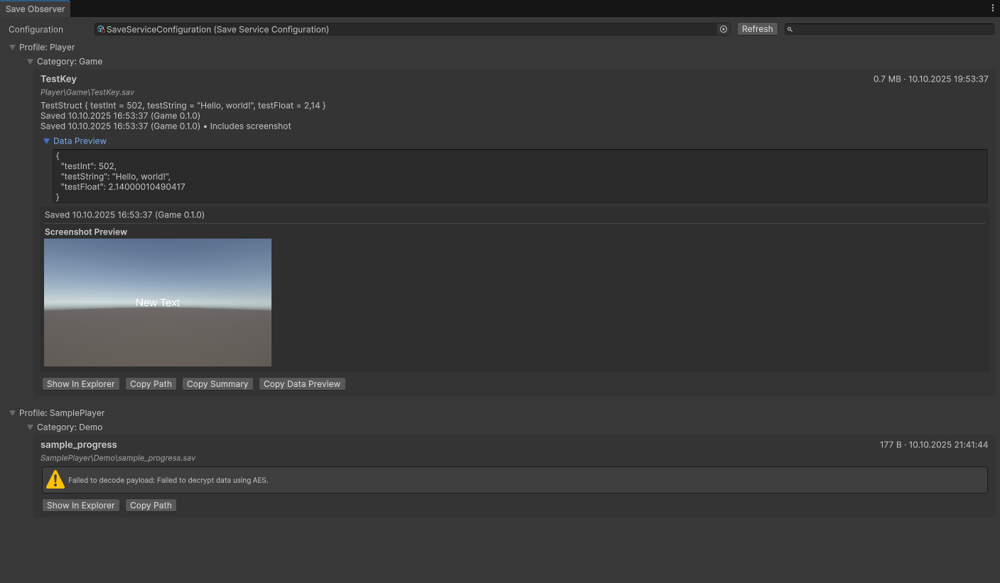

<div align="center">

# FLFloppa Save System

_Modular, editor-driven save/load infrastructure for Unity 2022.3+_

[](#requirements)
[](#license)
[](#support--questions)

</div>

The FLFloppa Save System is a production-ready framework that separates serialization, processing, storage, and migration concerns while keeping authorship squarely inside the Unity Editor. Designers and programmers can configure pipelines through ScriptableObjects, inspect saves with bespoke tooling, and ship robust data upgrades without rewriting gameplay code.

---

## Table of contents

* [Highlights](#highlights)
* [Requirements](#requirements)
* [Installation](#installation)
* [Quick start](#quick-start)
* [Architecture overview](#architecture-overview)
* [Editor tooling](#editor-tooling)
* [Samples](#samples)
* [Documentation](#documentation)
* [Testing](#testing)
* [Roadmap](#roadmap)
* [Contributing](#contributing)
* [Support & questions](#support--questions)
* [License](#license)

---

## Highlights

* __Version-aware saves__ – Chain `IDataMigrator` instances to migrate legacy payloads forward automatically.
* __Drop-in configurability__ – Swap serializers, storage providers, and processing steps without touching core gameplay code.
* __Editor-first workflow__ – UI Toolkit inspectors validate configurations, preview pipelines, and expose quick actions for designers.
* __Async from the ground up__ – Uses UniTask to persist data off the main thread.
* __Rich observability__ – The Save Observer window surfaces payload previews, metadata, and custom visual elements for any save.

---

## Requirements

* Unity **2022.3 LTS** or newer.
* [UniTask](https://github.com/Cysharp/UniTask) installed manually in your project (see below).
* [FLFloppa Editor Helpers](https://github.com/FLFloppa/editor-helpers.git) installed manually (UI Toolkit helpers are not bundled with the save system).
* Newtonsoft.Json (Unity provides `Unity.Plastic.Newtonsoft.Json` in modern LTS releases).

---

## Installation

### Via Git URL (recommended)

1. Open **Window → Package Manager**.
2. Click the **+** button → **Add package from git URL...**
3. Paste the repository URL with the package path parameter:
   ```
   https://github.com/FLFloppa/save-system.git
   ```
   To lock to a specific release, append `#v0.2.0` (or the desired tag) after the path.
4. Unity installs the package and its samples.

> **Install dependencies manually**: before entering play mode, add UniTask (`https://github.com/Cysharp/UniTask.git?path=src/UniTask/Assets/Plugins/UniTask`) and FLFloppa Editor Helpers (`https://github.com/FLFloppa/editor-helpers.git`) to your project via Git URL or preferred package workflow. The save system depends on these packages but does not pull them automatically.

### Via GitHub release (manual package file)

1. Visit the [GitHub releases page](https://github.com/FLFloppa/save-system/releases) and download the latest `.unitypackage` or packaged `.zip` artifact.
2. In Unity choose **Assets → Import Package → Custom Package…** and select the downloaded file.
3. Review the import dialog and click **Import** to bring the package assets into your project (they’ll appear under `Assets/` rather than `Packages/`).
4. Install UniTask and FLFloppa Editor Helpers manually as noted above before running the samples.

### Manual copy

1. Clone/download this repository.
2. Copy the `Packages/FLFloppa Save System/` folder into your Unity project `Packages/` directory.
3. Open Unity to generate assembly definitions.

---

## Quick start

1. **Create configuration assets** via the Project window context menu:
   * `FLFloppa/Save System/Serializer/Newtonsoft Json`
   * `FLFloppa/Save System/Storage/File System Provider`
   * `FLFloppa/Save System/Processing/All Modules Pipeline`
   * `FLFloppa/Save System/Save Service Configuration`
2. **Wire the Save Service Configuration** inspector:
   * Assign serializer, storage provider, pipeline, and optional migrators.
   * Define the current schema version.
3. **Bootstrap the service in code**:
   ```csharp
   public class SaveSystemBootstrap : MonoBehaviour
   {
       [SerializeField] private SaveServiceConfiguration configuration;
       private ISaveService _service;

       private void Awake()
       {
           _service = configuration.Build();
           _service.SetProfile("Player1");
           _service.SetCategory("Campaign");
       }

       public void SaveProgress(PlayerProgress progress)
       {
           _service.Save("progress", progress);
       }
   }
   ```
4. **Inspect saves** using the Save Observer window (`FLFloppa → Save System → Save Observer`).

For a guided walkthrough import the `Basic Setup` sample from the Package Manager.

---

## Architecture overview

* __Runtime/Core__ – Core abstractions and implementations (`SaveService`, `FileSystemStorageProvider`, serializers, processing modules, migrations, readable utilities).
* __Runtime/Unity__ – ScriptableObjects that configure runtime types (`SerializerConfiguration`, `ProcessingPipelineConfiguration`, etc.).
* __Editor__ – UI Toolkit inspectors, Save Observer window, validation utilities.
* __Tests__ – NUnit-based edit mode tests validating the pipeline.

The runtime API centers around `ISaveService`, exposing synchronous and async operations, profile/category scoping, and metadata-aware envelopes.

---

## Editor tooling

* __SaveServiceConfigurationEditor__ – Validates required components, visualises processing order, and surfaces migration warnings.
* __Processing module inspectors__ – Configure compression/encryption modules with guardrails.
* __StorageProviderConfiguration__ (`FileSystemStorageProviderAsset`)
  * Resolves cross-platform paths; inspector shows resolved directory and links to Finder/Explorer.
  * Combine with path strategy assets (`App Data`, `Game Folder`, `Custom`) to redirect saves without code changes.
* __StorageProviderConfiguration__ (`PlayerPrefsStorageProviderAsset`)
  * Persists payloads inside Unity `PlayerPrefs` with a configurable key prefix—ideal for lightweight prototypes or platforms without file access.
* __Save Observer window__ – Groups saves by profile/category, renders metadata, and supports custom `VisualElement` previews via `ISaveReadableElement`.

Path strategies (App Data, Game Folder, Custom) can be authored as ScriptableObjects and assigned to the storage provider, allowing you to redirect saves without code changes.



---

## Samples

Import the `Basic Save Service Setup` sample from the Package Manager to explore:

* Preconfigured serializer, storage, pipeline, and save service assets.
* A simple MonoBehaviour that performs save/load operations.
* Editor tips for using readable summaries and metadata.

Sample files live under `Samples~/BasicSetup/` within the package.

---

## Documentation

In-depth guides and API notes are published under `Documentation~/`.

* [Manual](Documentation~/manual/index.md) – Setup, architecture, editor tooling, and extensibility notes.
* [Readable data guide](Documentation~/manual/readable-data.md) – Making payloads and metadata designer-friendly.
* [Migration cookbook](Documentation~/manual/migrations.md) – Versioning strategies and best practices.

Unity Package Manager automatically links to these pages when the package is installed.

---

## Testing

The package ships with `FLFloppa.SaveSystem.Tests` (edit mode). Add NUnit tests under `Packages/FLFloppa Save System/Tests/` to cover migrations, storage fallbacks, and custom processors. Continuous integration guidance is provided in [`CONTRIBUTING.md`](CONTRIBUTING.md).

---

## Roadmap

* Additional storage providers (cloud backends, PlayerPrefs fallback).
* Visual pipeline editor and migration graphs.
* Play Mode analytics hooks.
* Expanded sample library (inventory systems, screenshot metadata, cloud sync).

See [`CHANGELOG.md`](CHANGELOG.md) for released milestones.

---

## Contributing

Contributions are very welcome! Please read [`CONTRIBUTING.md`](CONTRIBUTING.md) and adhere to our [`CODE_OF_CONDUCT.md`](CODE_OF_CONDUCT.md). Bug reports and feature requests can be opened as GitHub issues once the repository is public.

---

## Support & questions

* File an issue on GitHub (preferred).
* Email `flfloppa@yandex.ru` for private inquiries.

We also maintain a living design document under `Documentation~/` for long-form architectural decisions.

---

## License

This package is released under the [MIT License](LICENSE). You are free to use it commercially and modify/distribute it as long as you include the license notice.
